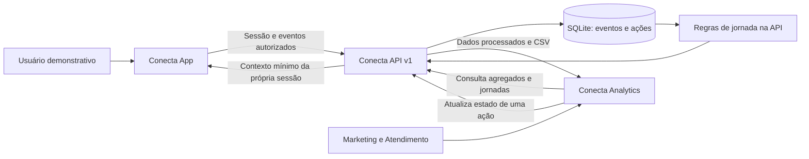

# Conecta API

## Integração com o Analytics

A saúde da API anuncia suporte a sinais históricos e recomendações em `capabilities`. O Analytics atualizado verifica essa compatibilidade antes de carregar. Execute `node scripts/check-integration.js` com os três repositórios em pastas irmãs para validar o fluxo usando o cliente original do App, sem modificá-lo. Veja [o guia integrado](docs/INTEGRATION.md).

## Evolução de jornadas e próximos passos

O contexto da sessão agora recomenda um próximo passo com regra e motivo, a partir de preferência explícita, exploração, ajuda ou conclusão. A nova consulta `/api/v2/admin/signals` avalia sinais na data histórica escolhida e informa se continuam ativos hoje. A consulta v1 foi preservada para o painel existente.

Leia [a evolução do backend](docs/EVOLUTION.md) para exemplos, integração dos novos campos e proposta de arquitetura Node.js serverless em AWS ou Azure. A implantação em nuvem continua planejada; a execução implementada usa Express e SQLite local.

### Acessos organizados. Jornadas compreensíveis. Ações explicáveis.

Backend do Conecta para o Hackathon Conexão Ancestral, **Petronect + KODIE Academy**. Evolui os conceitos da base de Ines para uma API de eventos versionada, com persistência local, regras de jornada, exportação e gestão de ações.

> **Protótipo funcional, dados fictícios.** Não se conecta ao Portal Petronect, não identifica pessoas reais e não dispara campanhas. API em Express, Node.js 24 e SQLite. MariaDB foi substituído no protótipo local; a migração e seus limites estão documentados.

**Explore:** [Arquitetura](docs/ARCHITECTURE.md) · [Contrato da API](docs/API.md) · [Dados e métricas](docs/DATA-MODEL.md) · [Execução integrada](docs/INTEGRATION.md) · [Produto e identidade](docs/PRODUCT.md) · [Roadmap](docs/ROADMAP.md) · [Contribuição](CONTRIBUTING.md) · [Segurança](SECURITY.md) · [Verificação](docs/VERIFICATION.md)

## Executar em poucos passos

```sh
npm ci
npm run setup
npm run seed
npm test
npm start
```

Saúde: **http://127.0.0.1:3000/health**. setup cria .env local com token administrativo aleatório e escrita habilitada; não sobrescreve arquivo existente. seed cria **37 eventos de 6 perfis fictícios em 9 sessões**, sem sobrescrever uma base que já possui eventos. Consulte ADMIN_TOKEN no .env para conectar o Analytics. Guia completo: [executar os três sistemas](docs/INTEGRATION.md).

Sem .env, o padrão é leitura pública dos dados fictícios e gravação bloqueada. Não há hospedagem da API provisionada nesta entrega.

## O desafio e a nossa resposta

O **Hackathon Conexão Ancestral**, da **Petronect**, com execução da **KODIE Academy**, propõe identificar os acessos ao Portal Petronect e usar esse conhecimento para apoiar o reengajamento de usuários. O material de abertura descreve uma lacuna entre contar cliques e compreender quem acessa, qual é o primeiro clique e com que frequência retorna.

O **Conecta** organiza esse problema em um ciclo demonstrável: **acesso → evento → jornada → sinal → próxima ação**. A proposta atende fornecedores e clientes na experiência de navegação e apoia Marketing e Atendimento na interpretação dos acessos.

**Todos os dados da nova API e do Analytics são fictícios. Não existe integração com o Portal Petronect.** As recomendações são regras transparentes para revisão humana, sem modelos preditivos, envio de campanhas ou promessa de aumento de conversão.

Fonte do escopo: material enviado pela equipe, _Slides_Abertura_Hackathon_Conexao_Ancestral.pdf_, páginas 2, 8, 9, 11 e 12, abertura de 14/09/2026. As páginas 8 e 9 sustentam o problema e o uso obrigatório de base simulada/protótipo demonstrável. O PDF original não é redistribuído aqui.

## Os três repositórios

| Repositório                                                                  | Responsabilidade                                                  | Execução local                  |
| ---------------------------------------------------------------------------- | ----------------------------------------------------------------- | ------------------------------- |
| [conecta-app](https://github.com/SouBeatrizKaroline/conecta-app)             | Frontend do usuário preservado e integração demonstrativa isolada | http://127.0.0.1:8080/demo.html |
| [conecta-api](https://github.com/SouBeatrizKaroline/conecta-api)             | Coleta, armazenamento, processamento, API e exportação            | http://127.0.0.1:3000/health    |
| [conecta-analytics](https://github.com/SouBeatrizKaroline/conecta-analytics) | Visão gerencial, jornadas, sinais e gestão de ações               | http://127.0.0.1:8081           |



O Analytics consulta a API por HTTP e atualiza sob demanda. Não há conexão direta dos frontends ao banco, WebSocket ou envio automático do backend ao painel.

## Entregas implementadas

- Sessões fictícias com tokens próprios e contexto mínimo para o App.
- Eventos de acesso, clique, interesse e conclusão, com validação e idempotência.
- Armazenamento SQLite, índices, relações e transações.
- Métricas de acesso, primeiro clique, retorno, timeline e regras explicáveis.
- Filtros por período e segmento; paginação de jornadas e sinais.
- CSV sem dados cadastrais, filtrado e limitado a 10.000 eventos.
- Gestão de ações e histórico de alteração, sem envio de comunicação.
- Autorização administrativa, CORS explícito, limite de requisições e retirada da coleta.

## Estrutura

```text
├── src/
│   ├── server.js                    # Inicialização e encerramento
│   ├── app.js                       # Rotas HTTP e autorização
│   ├── validation.js                # Contrato e filtros
│   ├── services/analytics.js        # Métricas, jornadas, sinais e CSV
│   └── db/{database.js,schema.sql}  # Persistência e catálogo fictício
├── scripts/{setup.js,seed.js}       # Ambiente local e dados simulados
├── test/api.test.js                 # Testes HTTP e persistência
├── docs/                            # OpenAPI, arquitetura e operação
├── .env.example                     # Variáveis, sem segredo
└── .github/                         # CI e modelo de PR
```

## Configuração

| Variável        | Padrão / finalidade                                  |
| --------------- | ---------------------------------------------------- |
| HOST            | 127.0.0.1; loopback local                            |
| PORT            | 3000                                                 |
| DB_PATH         | ./data/conecta.sqlite; arquivo não versionado        |
| DEMO_READ_ONLY  | true; false apenas no ambiente local de escrita      |
| ADMIN_TOKEN     | Pelo menos 32 caracteres; gerado por setup           |
| ALLOWED_ORIGINS | Origens locais 8080/8081; lista separada por vírgula |

## Limites técnicos

Uma instância, base pequena e processamento síncrono em memória. Não há usuários reais, SSO, filas, machine learning, envio de mensagens ou migração automática do banco anterior. Confira o [modelo de dados](docs/DATA-MODEL.md) antes de interpretar os indicadores e [SECURITY](SECURITY.md) antes de hospedar.

## Equipe 05

| Integrante                         |
| ---------------------------------- |
| Ines Correa Gomes Cardinot         |
| Beatriz Karoline Cordeiro da Silva |
| Kesly Aquinoã Ferreira da Silva    |
| Milene Arnaldo Ribeiro Belotto     |
| Ana Carolina Pereira Ruas          |

Os papéis individuais devem ser definidos pela equipe. Esta documentação não atribui funções ou resultados de seleção não confirmados.

## Desenvolvimento e licença

Leia [CONTRIBUTING](CONTRIBUTING.md) para branches, Conventional Commits, revisão e padrões. Veja [roadmap](docs/ROADMAP.md), [segurança](SECURITY.md) e [origem da implementação](docs/PROVENANCE.md). A licença MIT está **sugerida para decisão da equipe**, conforme [LICENSE](LICENSE); não foi aplicada retroativamente ao código herdado.
